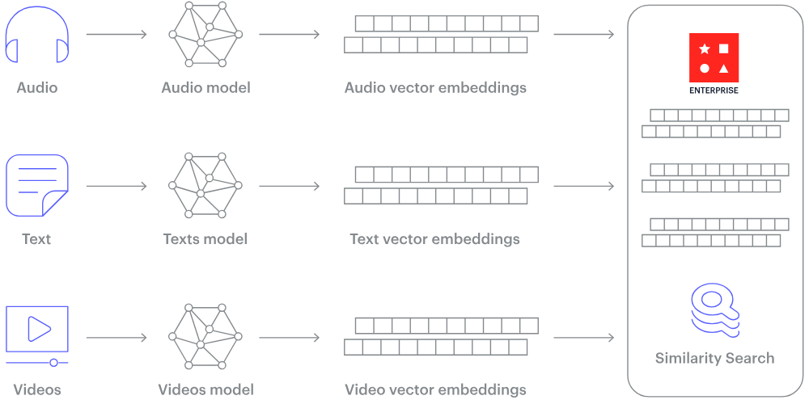
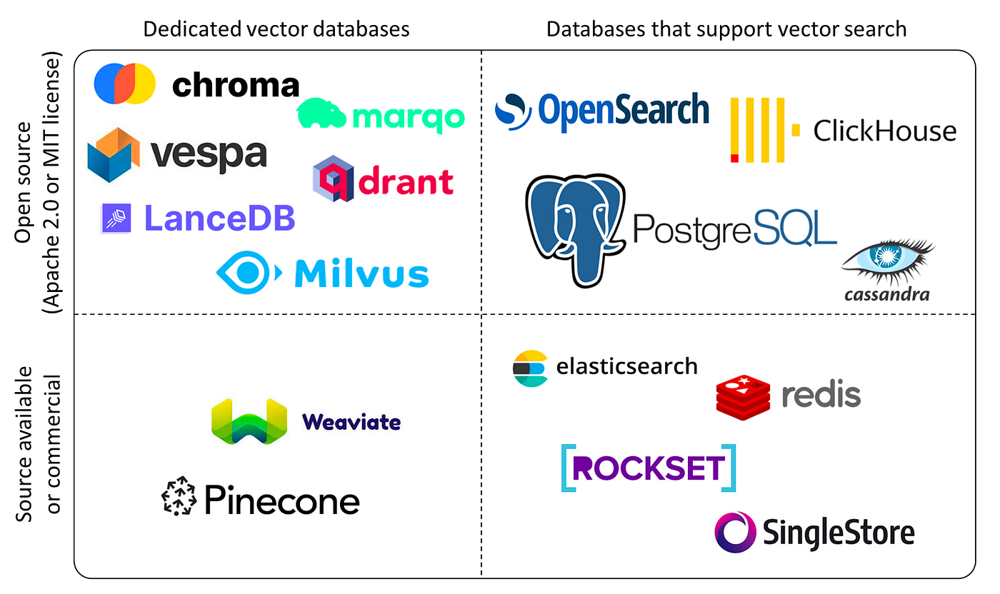
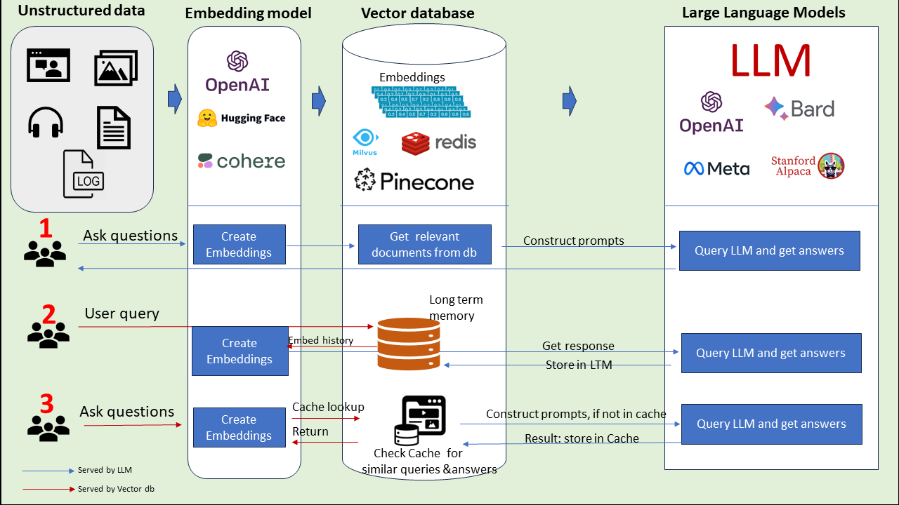
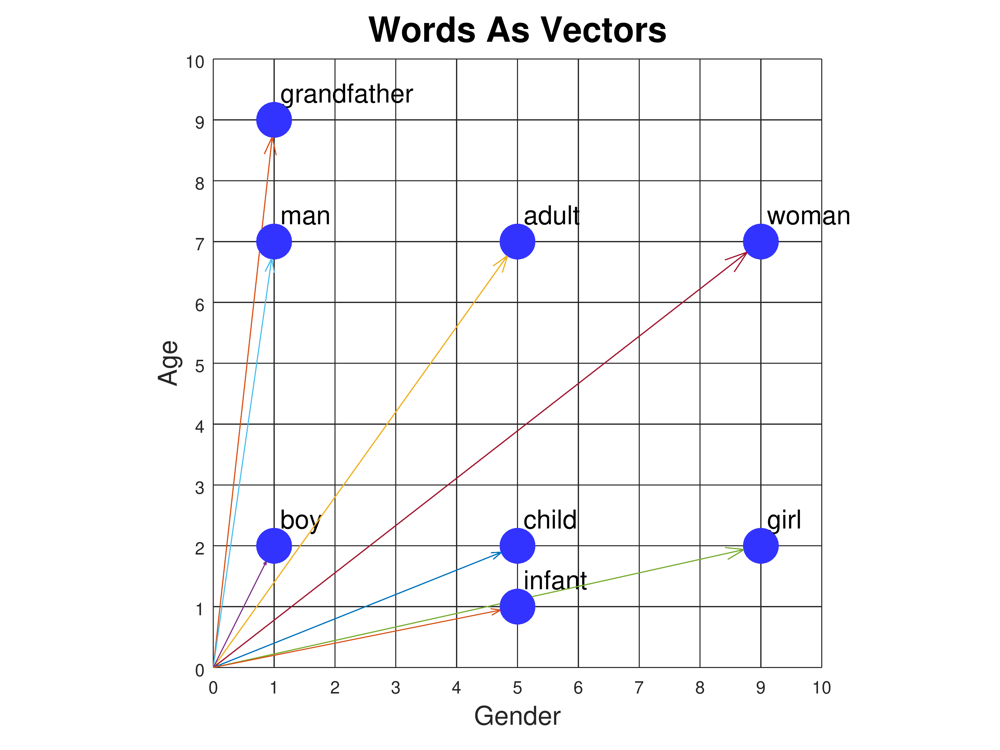

# Vector Databases
- Why the interest in vector databases?
- Down the rabbit hole

## What are vector databases?

Usages:
- LLM
- Improving the accuracy of recommendation systems
- Enhancing natural language processing capabilities
- Advancing image and speech recognition technologies
- **Anomaly** detection

## What vector databases are available?


## How are they used?


## Embeddings


```python
boy = [1, 2]
man = [1, 7]
grandfather = [1, 9]
infant = [5, 1]
child = [5, 2]
adult = [5, 7]
```